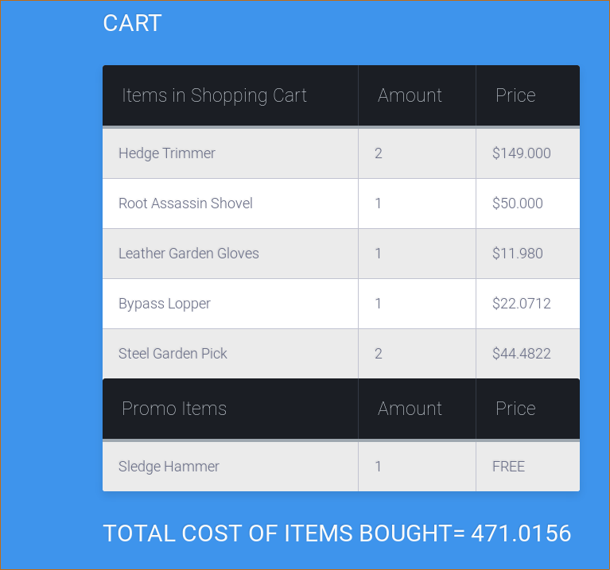

---

\ \
\ \
\ \
\ \
\ \
\ \
\ \
\ \
\ \
\ \
\ \
\ \
\ \
\ \
\ \
\ \
\ \
\ \
\ \
\ \
\ \

*Martin Nestorov* __________________

**INF 335 Web Server Technologies**

---

\ \
\ \
\ \
\ \
\ \
\ \
\ \
\ \
\ \
\ \
\ \
\ \
\ \
\ \
\ \
\ \
\ \
\ \
\ \
\ \
\ \
\ \
\ \
\ \
\ \
\ \
\ \
\ \
\ \
\ \
\ \
\ \
\ \
\ \
\ \
\ \
\ \

*“I hereby declare that the submitted project is all my own work. I did not copy the software from someone or somewhere else. No one but me developed the software.”*

**Signatute** __________________

---

## Architecture

The architecture of the project follows a basic `MVC` pattern, where there are specific classes and files that handle only the **view** of the *app*, some which only interact with the **model**, and those that are concerned with **controlling** the two.

More specifically, from all of the files that build up this project, the *model* files (`pdo.php`, `catalogue.php`, `client.php`, `promo.php`, `redirect.php`) have a direct connection with the `MySQL` Database, allowing for the app to have a nice separation from that data, making it **less state-full**.

The purely *view-oriented* files are two types, those which contain only `css` code, and those that are somewhat intertwined with the controller part of the app. These are the `index.php`, `indexstyle.php`, `cartstyle.php`, `loginstyle.php`, `login.php`, and `register.php`.

An interesting part of the project is the *controller*. Since this is `PHP`, the controller is the one that makes the model and the view play nice, but because of some limited capabilities of the language, the controller was, to some extent, used as a view as well. Most of the controller files (`register.php`, `login.php`, `showCart.php`, `showCatalogue.php`, `showPromo.php`, `showGetLucky.php`) both load and manipulate the data in some way to look good, but they also get the data from the model.

``` php
// pdo.php
<?php
$servername = "127.0.0.1";
$dbname = "garden_x_travaganza";
$dsn = "mysql:host=$servername;dbname=$dbname";
$user = "martin";
$pass = "me4kaikop4e";

$conn = new PDO($dsn, $user, $pass);
// set the PDO error mode to exception
$conn->setAttribute(PDO::ATTR_ERRMODE, PDO::ERRMODE_EXCEPTION);
?>

// client.php
<?php
class client {

    function __construct($db) {
        $this->db = $db;
    }

    function get($name) {
        try {
            $sql = "SELECT * FROM users WHERE username='".$name."'";
            $stm = $this->db->prepare($sql);
            $stm->execute(array($name));
            return $stm->fetchAll()[0];
        } catch (PDOException $pdoe) {
            echo "<br>Could not fetch user ".$name."<br>".$pdoe->getMessage();
        }
    }

// login.php
<?php
require "pdo.php";
require "client.php";
require "redirect.php";

session_start();
```

From this snippet here we can see how we have a model, which is loaded by a controller, and the passed onto a view, for the data to be displayed. The `client` class is the mode, where together with the `pdo`, it issues **prepade** `SQL` statements. The result is handled by a controller, which is then applied to some `HTML`.

## Implementation in detail

The project was quite big to begin with, so it took a lot of time to create. Although the application isn't as complex as it can be, there are a few tricky parts, which I had to overcome.

#### Login and Registration

The login and registration act in this way. Some client navigates to any `url` that is part of the application domain, and if that client is not authorized, via a *session variable* called `$_SESSION['authorized']`, then he/she is redirected to the `login` page. There, a user can either register or just login.

If a registration is issued, there are a few things that happen. First the *user name* is checked that it is *unique*. If it is not, the client is notified and he/she can try again. Otherwise, the new user name and password are stored in the Database. The password is **encrypted** using a *built-in function* of `PHP` to securely encrypt data:

``` php
$newUser;
$hashed_password;
if (isset($_POST['newUserName']) && isset($_POST['newPasswd'])) {
    $newUser = $_POST['newUserName'];
    $hashed_password = password_hash($_POST['newPasswd'], PASSWORD_DEFAULT);
}
```

After that, the client is redirected to the `index.php` page.

If the client just logs-in, again a few things are happening. First the *username* and *password* are extracted from the Database and compared with the input ones. If the user is not part of the database, the client is notified and he/she can go and register. After the user is retrieved, again through another built-in `PHP` method, the input password and the encrypted one are compared to verify the client:

``` php
// Checks that the user password is a valid hash of the saved passwrd in the DB
if(password_verify($userPass, $user['password'])) {
    $_SESSION['authenticated'] = true;
    redirect("index.php");
}
```

Because we are retrieving and sending data to the database, it is important to mention that throughout the whole project, a simple build pattern is used to connect to the database. This is done through a single `pdo` object, which is in it's own file `pdo.php`. Then all files that wish to use that object, simply need to `include/require` that file. Then that singleton is plugged into a class that can issue SQL queries to the database. There classes, as already mentioned, are `client.php` (`client`), `catalogue.php` (`catalogue`), and the `promo.php` (`promo`).

**NOTE**: It's important to mention that these input forms are both made *sticky* and with basic input validation. Of course the database connection has another layer of input validation.

``` html
<input type="text" name="userName" class="login-field" value="<?php if (isset($_POST['userName'])) echo $_POST['userName']; ?>" placeholder="username" id="login-name">

<input type="password" name="passwd" class="login-field" value="" placeholder="password" id="login-pass" required>
```
#### Main page and functionality

After a successful login/registration, we are redirected to the *main splash* page, which consists of 3 buttons. We can checkout the catalogue, go look for some lucky deals, or enter in a promo code.

The first two options work almost exactly the same, in that they have a very similar, if not, identical functionality, but they interact with different data, which gets tricky. The hardest part about this was that I had to maintain two states for the two types of products that are being bought. On one side we have normal goodies, but on the other, some are with a discount. which means that in the end, the cart has to manage both things in sync.

Although this was a challenge, and the code got bloated a bit from all of the array handling, the cart handles all types of user bought products, both on a discount and on full price!

Here I want to mention that the get lucky functionality just takes in some *random amount of items* from the database, implemented with `SQL`, and then *randomly* reduces the prices of these products. The client has full freedom on what he/she want's to buy.

#### Promo codes

The last part of the functionality of the project are the **promo** codes. They are pretty cool in my opinion, because this part of the application connects to another table in the database and checks a special code. The code is actually a **version 4 UUID** number, which by itself is pretty unique. For each one item type in the database, there is one promo code. If the entered code is correct, then that item is given for *free* to the user, as a promotion of the store!. Why did I choose for that item to be free? Because reducing the price was already implemented and I didn't want things to get boring.

Again, these inputs are maintain by basic validation, until they reach the `SQL` validation, and have a *sticky* form for it.

#### The Cart

The final part of the project is the cart. This was maybe the most difficult thing, apart from the design, that I had to do. Because I have 3 types of purchases - *normal*, *promoted*, and *reduced in price*, the cart had to be in perfect **synchronization** with everything.

After some trial and error, I decided that the reduced and normal items should be in a single table, and the promoted items, will be just below so a user can easily tell things apart.

``` php
// Get normal cart items
$cat = new catalogue($pdo);
$cartSet = $cat->getSetOf($_SESSION['cart']);
$itemsCount = array_count_values($_SESSION['cart']);
$allItems = array();
foreach ($cartSet as $cs) {
    foreach ($itemsCount as $i => $c) {
        if ($cs['item'] == $i) {
            $allItems[] = [$c => $cs];
        }
    }
}
```

One of the most difficult things in the project was the fact that arrays in `PHP` don't act like normal arrays, and the dynamic binding on every datatype made things even worse, but that was mostly on my fault.

``` php
// Make the lucky items unique array so that there are no duplicates in the table
$temp2 = array();
foreach ($_SESSION['luckyCart'] as $lc) {
    foreach ($lc as $item => $price) {
        if (!in_array($item, $temp2)) {
            $temp2[$item] = $price;
        }
    }
}
```

Another hard part of the project was dealing with the sessions. Since sessions have a shared state, and they keep information in the browser, some of the time, I didn't know if the code I was changing, was really being loaded, since the browser kept a previous state about things. This led to some undefined behavior at some point, but in the end, I managed to get on top!

## Bonuses

#### The Database

Since the whole project was created in a local environment, some additional steps had to be made. For one, I had to install my own `apache` server, which had to run and execute `PHP` code. That alone took quite some time to get going. After that I installed MariaDB, one of many implementations of MySQL, and then I populated my database.

I kept a record of all of the `SQL` statements I had to run in order to complete this. It's located in a `statements.sql` file in the project. Here are a few:

``` sql
-- Step 0.
-- Create a user with privileges to a database.
CREATE user 'martin'@'localhost' IDENTIFIED BY 'me4kaikop4e';
GRANT ALL PRIVILEGES ON *.* TO 'martin'@'localhost';
FLUSH PRIVILEGES;

-- Step 1.
-- Create a database and use it.
CREATE DATABASE garden-x-travaganza;
USE garden_x_travaganza;

-- Step 2.
-- Create tables.
CREATE TABLE users (username TINYTEXT, password TEXT);
CREATE TABLE catalogue (item TINYTEXT, id INT, price FLOAT(255, 3) unsigned,
description LONGTEXT, imgpath TINYTEXT);
CREATE TABLE promo (code VARCHAR(50), item TINYTEXT);

INSERT INTO catalogue (item, id, price, description, imgpath)
VALUES("Leather Garden Gloves", 456025, 11.98, "Breathable 4-way stretch spandex back
helps reduce hand fatigue and keeps hands cool. Touch screen capabilities on the index
finger. Adjustable hook and loop wrist helps keep unwanted dirt and debris out of the
glove.", "/gloves.jpg");
INSERT INTO catalogue (item, id, price, description, imgpath)
VALUES("Hand Tool Kit", 748596, 59.95, "Gardener seat and tools. Sturdy, lightweight
and portable. Tool pockets on exterior of storage tote.", "/kit.jpg");
INSERT INTO catalogue (item, id, price, description, imgpath)
VALUES("Bulb Auger", 418503, 14.98, "Dig holes up to 22 inches deep and 2-3/4 inches
wide. Just insert into any 3/8 inch or larger drill.", "/auger.jpg");

INSERT INTO promo (code, item) VALUES("6daee431-5882-416b-b60a","Sledge Hammer");
INSERT INTO promo (code, item) VALUES("3b632813-6b36-4563-bf16","Hedge Trimmer");
INSERT INTO promo (code, item) VALUES("d55f2ce8-33ba-43cf-bb19","Root Assassin Shovel");
INSERT INTO promo (code, item) VALUES("6f931dc4-b79e-42d7-bc92","Bypass Hand Pruner");
INSERT INTO promo (code, item) VALUES("bb4f918a-a0df-4081-b5e9","Steel Camp Axe");

-- Plumbing commands --

-- Just get everything.
SELECT * FROM tablename;

-- Remove table entries.
DELETE FROM users WHERE username='XXXX';

-- Update table column data types.
-- This is just an example on how to modify a column data type.
ALTER TABLE users MODIFY username TINYTEXT;

-- Show the details of a table.
SHOW FIELDS FROM table_name;

-- Update a specific column value of a table;
UPDATE catalogue SET imgpath='/assets/hedge_trimmer.jpg' WHERE item='Hedge Trimmer';
```

This whole procedure was both fun and challenging, since it was out of the scope of the requirements, but it wasn't something that stopped me in my tracks.

And of course, here is how some of the tables in my Database looked like:

``` sql
MariaDB [garden_x_travaganza]> select * from promo;
+-------------------------+-----------------------+
| code                    | item                  |
+-------------------------+-----------------------+
| 6daee431-5882-416b-b60a | Sledge Hammer         |
| 3b632813-6b36-4563-bf16 | Hedge Trimmer         |
| d55f2ce8-33ba-43cf-bb19 | Root Assassin Shovel  |
| 6f931dc4-b79e-42d7-bc92 | Bypass Hand Pruner    |
| bb4f918a-a0df-4081-b5e9 | Steel Camp Axe        |
| 6a2b4397-c840-405f-ab8e | Bypass Lopper         |
| f8df22b9-3c66-4bf4-8007 | Steel Garden Rake     |
| 0743ac4d-3000-4bfd-84c7 | Steel Garden Pick     |
| 208d8de9-2896-4ffc-a27b | Leather Garden Gloves |
| 87c76eec-af33-4b79-a607 | Hand Tool Kit         |
| fbb27b4d-98e6-478f-b1e1 | Bulb Auger            |
+-------------------------+-----------------------+
11 rows in set (0.00 sec)


MariaDB [garden_x_travaganza]> select * from users;
+----------+--------------------------------------------------------------+
| username | password                                                     |
+----------+--------------------------------------------------------------+
| Martin   | $2y$10$sPRbNjkz9fye8tOPA.Nsq.PmvNsl.u3W8DjRUnJmE88ufnJr3bMiS |
| Olivia   | $2y$10$cED7bMQ8RFwFIhwLhJuRU.PpE2wFRICuAK.CWvUwPbYQr8OEiJ5L. |
| Nasko    | $2y$10$zzPlLr8NRjnS4YoolsJvwubHQZBLwAUhAGzXPt38B97w3Qwlr.NLe |
| Dani     | $2y$10$3D9lwLmeCIy.DN/GBYkaKugt0B2c.PPjsY7HuoH33Jh2O6U0XRM2u |
| Ivan     | $2y$10$dZ3DywUTUV7Oom9PAlbS2um2XTPwDCCN9oOqltuKozti3AzJv1LXm |
| Stefan   | $2y$10$VKRd7XBGxlPiZjQwcA1QKeY2nIP1uzhx/WjjeYZxpjv.zQDYQKXvm |
| Zaro     | $2y$10$4iLBx/ucOgTsAPQKPzODIOS.D/L.oimq12hmQY0UmZh5dRnwhObA2 |
+----------+--------------------------------------------------------------+
8 rows in set (0.00 sec)
```
#### Styling

The hardest part of this whole project for me was the fact that I wanted to style things properly. All other problems were hard, but I knew that I can do it, but I am nowhere with design. I drew inspiration from so many places and spent so much time, just so I can make things visually appealing.

I say this only to complain that I am not a front-end developer :)

## Screenshots


This is how the normal login looks like.


The user is not allowd to enter an empty string, validated through the front-end.


The same thing happens with the registration. No invalid inputs are allowed, since they are checked in the DB and the front-end.


This is the index of the app, where we can navigate to several places, come back, and explore some more.


This is the normal catalogue, where all of the data we care about the items, is given to use. We can easily fill out cart with as many things as we want, and on top we can see how much things we have stored in the cart.


This is the listing of the cart, with a total sum. We can also see that there are no items which have been reduced in prices and put into the cart.


Here we can see some items which have been reduced in price and also put into the cart, We can tell that this has happened, since some of the prices seem like they have been reduced by a percentage.




And here we can see how the code input works, where it tells us that we have enterd the right code and that we can checkout our cart. There we can find we have one free item! Of course, we cannot have more of the same free item, so if we enter the same code many times, we sill only have one free time!
